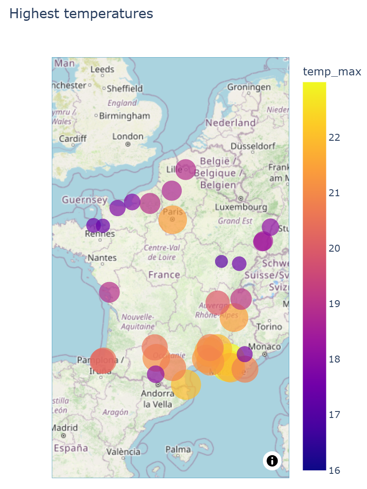
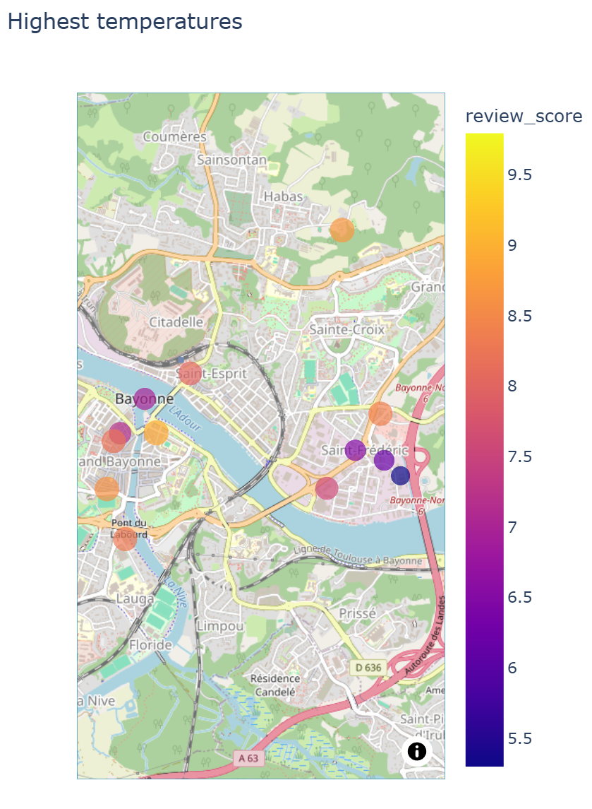

# Project_Kayak

## Objective

The objective of this project is to scrap booking and collect data from a weather API to load them on an S3 and a SQL database (ETL process) create graphs using the collected data to help inform decisions regarding holidays planning. 

## How to use

- 01-kayak_collection.ipynb collects data from the API and stores them on S3.
- 02-kayak_ETL.ipynb handles collects the data from S3, cleans them and stores them in an OLTP (neonDB)
- 03-kayak_graph.ipynb graphs the maps afterward, based on the collected informations.

## Dataset

The dataset is composed of information coming from:
- Weather API (Openweathermap): contains all the data regarding the weather (temperature, cloudiness, etc.). The temperature is mainly used in this project.
- Booking website: Contains all the data regarding the hotels (Name, city, location, ratings etc.)

## Study

This study is decomposed in two parts:
- An ETL pipeline that collects weather data from the openweatherapi and the booking website, cleans them and loads them on an s3 and a OLTP database.
- A visualisation notebook that collects the data and creates maps helping to plan holidays:
    - One map showing the best cities to visit based on the weather.
    - One map for each of the 5 best cities, showing the 20 best hotels for each of them.

**ETL pipeline**
The Extraction is performed on the openweathermap API and by scrapping the booking website. 
The raw data are stored directly on s3, before being cleaned and formatted so then can fit in an OLTP type database. In this project, NeonDB will be used to host the database.
The transformation includes a rating of the weather in each of the cities listed (based on the temperature at the moment).

**Visualisation**
Weather classification at the time of the test:

Example of a map of Bayonne showing the best hotels in the city.

## TODO
Finish proper data pipeline (saving and loading from S3)
